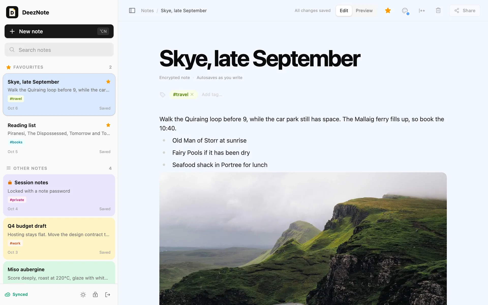

# DeezNote

End-to-end encrypted Markdown notes that work offline.

Notes are encrypted in the browser before they sync. The server stores ciphertext and the metadata it needs to sync it, and never sees a note's title, text, tags or photos.

**[Try it](https://deeznote.103-253-146-20.sslip.io)** · [Privacy Policy](https://deeznote.103-253-146-20.sslip.io/privacy) · [Security](SECURITY.md)

<picture>
  <source media="(prefers-color-scheme: dark)" srcset="apps/web/public/landing/workspace-dark.webp">
  
</picture>

> [!WARNING]
> DeezNote has not had an independent security audit. Don't rely on it for secrets whose exposure would put you at risk.

## Features

- **End-to-end encryption.** XChaCha20-Poly1305 with a random key per note, wrapped by a vault key that only your passphrase unlocks.
- **Offline first.** Notes live in IndexedDB and sync when you're back online. Conflicting edits are kept, not overwritten.
- **Markdown editor.** Slash commands, lists, code blocks, and photos you can resize in place.
- **A second lock.** Any note can have its own password on top of the vault passphrase.
- **Organise.** Favourites, tags, search and ten page colours, in light and dark.
- **Installable.** A PWA for desktop and mobile.
- **Export.** Download every note as Markdown files with photos, ready for Obsidian or any other editor. The export is built on your device.

## How the encryption works

DeezNote uses two separate secrets:

| Secret | Who sees it | What it does |
|---|---|---|
| Account password | Sent to the server over HTTPS, stored as an Argon2id hash | Signs you in |
| Vault passphrase | Never leaves your device | Derives the key that unlocks your notes |

```
vault passphrase ──Argon2id──▶ passphrase key ──unwraps──▶ vault key (random, 256-bit)
                                                              │
                                                              └──unwraps──▶ note key (random, one per note)
                                                                                │
                                                                                └──decrypts──▶ note
```

- Every layer uses XChaCha20-Poly1305 from [libsodium](https://doc.libsodium.org/). Each note's key and content are bound to the note's ID as authenticated data, so the server can't swap one note's ciphertext into another.
- A note password adds an independent Argon2id-derived layer inside the note's encryption.
- The vault locks after 15 minutes without activity. Keys are wiped from memory on lock.
- Because the server never has your passphrase, **nobody can reset it.** Lose it and your notes are gone.

### What the server can see

Your email, your encrypted vault key and its salt, and for each note: a random ID, the ciphertext, its size, a version number and when it was last saved. The server also keeps access logs for 100 days, as Thai law requires. The [Privacy Policy](https://deeznote.103-253-146-20.sslip.io/privacy) lists everything, and a test fails if the data-handling code changes without the policy being reviewed.

### Limits of the threat model

- **The server delivers the app's code.** A compromised server could ship JavaScript that captures your passphrase. This applies to every web-based end-to-end encrypted app; a Content-Security-Policy and open source code reduce the risk but don't remove it.
- **Rollback.** A malicious server could serve an older version of a note.
- **Metadata.** Note count, sizes and save times are visible to the server.

## Architecture

```
apps/
  web/        React 19, Vite, Tailwind CSS v4, Milkdown editor, Dexie (IndexedDB), libsodium. A PWA.
  api/        Bun, Elysia, SQLite (WAL) with Drizzle ORM. Stores ciphertext; never decrypts.
packages/
  shared/     Types shared by the web app and the API.
deploy/       Server setup and backup scripts.
```

The API is small on purpose: authentication, sessions, the encrypted vault envelope, and note storage with optimistic versioning. Storage quotas, request size limits and per-IP and per-account rate limits are enforced on the server.

## Development

Requires [Bun](https://bun.sh) 1.4 or later.

```bash
git clone https://github.com/KantaKan/DeezNote.git
cd DeezNote
cp .env.example .env
bun install
bun run dev
```

The web app runs at http://localhost:5173 and the API at http://localhost:3000. The SQLite database is created and migrated when the API starts.

| Command | What it does |
|---|---|
| `bun run dev` | Start the API and web app with hot reload |
| `bun test` | Run every test suite |
| `bun run typecheck` | Typecheck all workspaces |
| `bun run build` | Build for production |
| `bun run db:generate` | Create a migration after changing `apps/api/src/db/schema.ts` |
| `bun run policy:fingerprint` | Print the fingerprint after reviewing the legal pages |

Tests cover the encryption (vault, notes, note passwords, legacy formats, tampering), the API's auth, quotas and abuse limits against a real SQLite database, and note export.

## Deployment

A push to `main` runs typechecks, tests and the build in GitHub Actions, then ships a release to the server over SSH, switches to it and health-checks it, rolling back automatically if it fails. The API runs as a systemd service behind Caddy, and the database is backed up daily. See [DEPLOY.md](DEPLOY.md).

## Contributing

Issues and pull requests are welcome. Before opening a pull request:

- Run `bun test` and `bun run typecheck`.
- If your change affects what data is collected, stored, sent or kept, update the Privacy Policy and Terms in `apps/web/src/legal/content.tsx`, in English and Thai. The policy test explains the steps.

Please report security issues privately. See [SECURITY.md](SECURITY.md).

## License

[AGPL-3.0](LICENSE). If you run a modified version of DeezNote as a service, you must make your source code available to its users.
